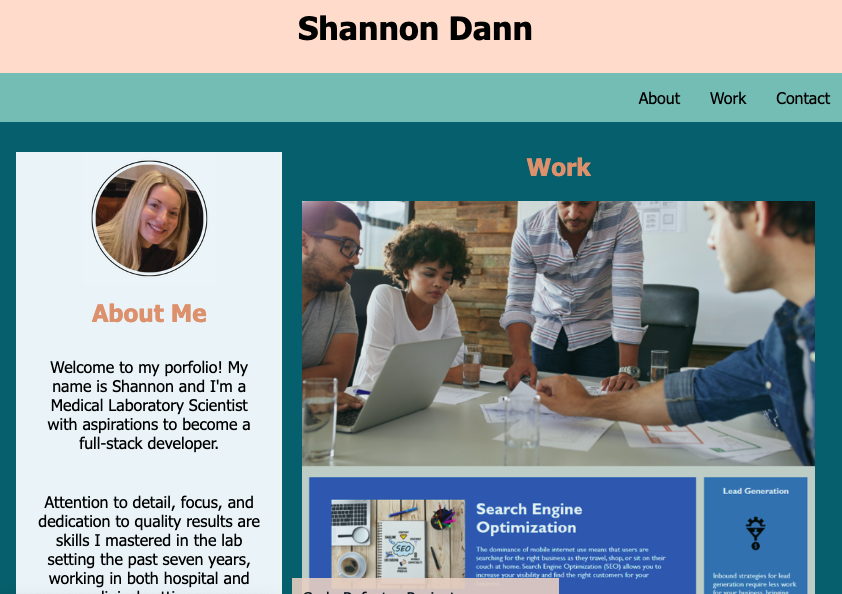

# Shannon Dann's Professional Portfolio

## Description
This webpage serves as a professional portfolio of my work in the coding bootcamp.

I created this page to document my work as I progress in the course. It also allows me to showcase my projects to potential employers. As I progress through the coding bootcamp, my portfolio will be updated with additional content. 

In this initial phase of my portfolio, I demonstrated the following skills: HTML, CSS, and advanced CSS. 

## Installation

N/A

## Usage

My professional portfolio consists of three main sections. 

* An 'About Me' section displays my photo and describes my background, skills, and aspirations. 

* My projects are showcased in the 'Work' section. The projects are shown as screenshots with titles, which link to the deployed webisite upon clicking. 

* The bottom of my portfolio is where the 'Contact' section is. There are icons with embedded links for my email, GitHub account, and LinkedIn profile. 

## Credits

N/A

## Link to Deployed Website

[Shannon's Professional Portfolio](https://smdann.github.io/professional-portfolio/)

## License

MIT License

Copyright (c) 2022 smdann

Please refer to the license in the repo for more information.